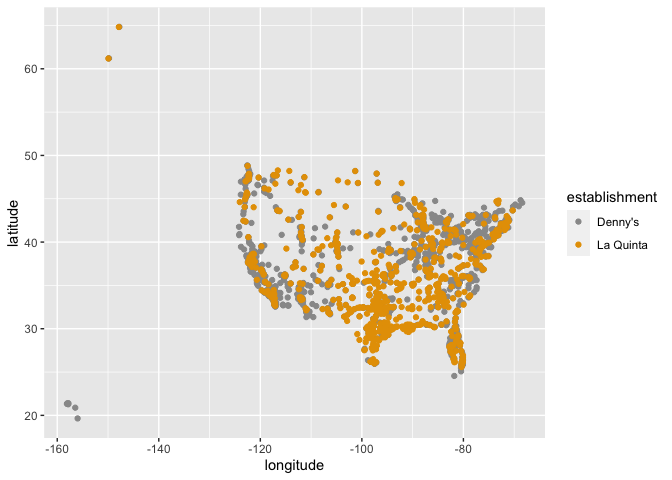
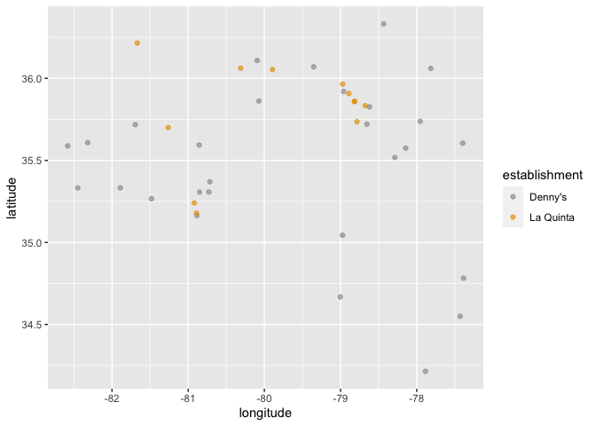
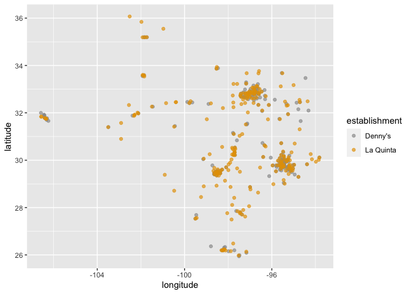

Lab 05 - La Quinta is Spanish for next to Denny’s, Pt. 2
================
Ye Dam Yi
03/02/2021

### Load packages and data

``` r
# install.packages("devtools")
devtools::install_github("rstudio-education/dsbox")
```

    ## gradethis (5a39f7ab3... -> d753e54a4...) [GitHub]
    ## tibble    (3.0.6        -> 3.1.0       ) [CRAN]
    ## ps        (1.5.0        -> 1.6.0       ) [CRAN]
    ## farver    (2.0.3        -> 2.1.0       ) [CRAN]
    ## lubridate (1.7.9.2      -> 1.7.10      ) [CRAN]
    ## htmltools (8d5a998e5... -> ac43afe7b...) [GitHub]
    ## tune      (0.1.2        -> 0.1.3       ) [CRAN]
    ## renv      (0.12.5       -> 0.13.0      ) [CRAN]
    ## 
    ##   There are binary versions available but the source versions are later:
    ##        binary source needs_compilation
    ## ps      1.5.0  1.6.0              TRUE
    ## farver  2.0.3  2.1.0              TRUE
    ## tune    0.1.2  0.1.3             FALSE
    ## 
    ## 
    ## The downloaded binary packages are in
    ##  /var/folders/1l/r517_ff9563_ybddlwk4br3r0000gp/T//RtmpZNpLrQ/downloaded_packages
    ## learnr    (0.10.1       -> 747356362...) [GitHub]
    ## htmltools (8d5a998e5... -> ac43afe7b...) [GitHub]
    ## htmltools (8d5a998e5... -> ac43afe7b...) [GitHub]
    ## 
    ##      checking for file ‘/private/var/folders/1l/r517_ff9563_ybddlwk4br3r0000gp/T/RtmpZNpLrQ/remotesbc56f10f842/rstudio-htmltools-ac43afe/DESCRIPTION’ ...  ✓  checking for file ‘/private/var/folders/1l/r517_ff9563_ybddlwk4br3r0000gp/T/RtmpZNpLrQ/remotesbc56f10f842/rstudio-htmltools-ac43afe/DESCRIPTION’
    ##   ─  preparing ‘htmltools’:
    ##      checking DESCRIPTION meta-information ...  ✓  checking DESCRIPTION meta-information
    ##   ─  cleaning src
    ##   ─  checking for LF line-endings in source and make files and shell scripts
    ##   ─  checking for empty or unneeded directories
    ##   ─  building ‘htmltools_0.5.1.9000.tar.gz’
    ##      
    ##      checking for file ‘/private/var/folders/1l/r517_ff9563_ybddlwk4br3r0000gp/T/RtmpZNpLrQ/remotesbc51b2cb26a/rstudio-learnr-7473563/DESCRIPTION’ ...  ✓  checking for file ‘/private/var/folders/1l/r517_ff9563_ybddlwk4br3r0000gp/T/RtmpZNpLrQ/remotesbc51b2cb26a/rstudio-learnr-7473563/DESCRIPTION’
    ##   ─  preparing ‘learnr’:
    ##      checking DESCRIPTION meta-information ...  ✓  checking DESCRIPTION meta-information
    ##   ─  checking for LF line-endings in source and make files and shell scripts
    ##   ─  checking for empty or unneeded directories
    ##   ─  building ‘learnr_0.10.1.9008.tar.gz’
    ##      
    ##      checking for file ‘/private/var/folders/1l/r517_ff9563_ybddlwk4br3r0000gp/T/RtmpZNpLrQ/remotesbc532e96747/rstudio-education-gradethis-d753e54/DESCRIPTION’ ...  ✓  checking for file ‘/private/var/folders/1l/r517_ff9563_ybddlwk4br3r0000gp/T/RtmpZNpLrQ/remotesbc532e96747/rstudio-education-gradethis-d753e54/DESCRIPTION’
    ##   ─  preparing ‘gradethis’:
    ##      checking DESCRIPTION meta-information ...  ✓  checking DESCRIPTION meta-information
    ##   ─  installing the package to process help pages
    ##      Loading required namespace: testthat
    ##   ─  saving partial Rd database
    ##   ─  checking for LF line-endings in source and make files and shell scripts
    ##   ─  checking for empty or unneeded directories
    ##    Removed empty directory ‘gradethis/archive’
    ##      Removed empty directory ‘gradethis/scripts’
    ##   ─  building ‘gradethis_0.2.3.9000.tar.gz’
    ##      
    ##      checking for file ‘/private/var/folders/1l/r517_ff9563_ybddlwk4br3r0000gp/T/RtmpZNpLrQ/remotesbc55a355a6a/rstudio-education-dsbox-578bc60/DESCRIPTION’ ...  ✓  checking for file ‘/private/var/folders/1l/r517_ff9563_ybddlwk4br3r0000gp/T/RtmpZNpLrQ/remotesbc55a355a6a/rstudio-education-dsbox-578bc60/DESCRIPTION’
    ##   ─  preparing ‘dsbox’:
    ##    checking DESCRIPTION meta-information ...  ✓  checking DESCRIPTION meta-information
    ##   ─  checking for LF line-endings in source and make files and shell scripts
    ##   ─  checking for empty or unneeded directories
    ##   ─  building ‘dsbox_0.1.1.tar.gz’
    ##      
    ## 

``` r
library(tidyverse) 
```

    ## ── Attaching packages ─────────────────────────────────────── tidyverse 1.3.0 ──

    ## ✓ ggplot2 3.3.3     ✓ purrr   0.3.4
    ## ✓ tibble  3.1.0     ✓ dplyr   1.0.4
    ## ✓ tidyr   1.1.2     ✓ stringr 1.4.0
    ## ✓ readr   1.4.0     ✓ forcats 0.5.1

    ## ── Conflicts ────────────────────────────────────────── tidyverse_conflicts() ──
    ## x dplyr::filter() masks stats::filter()
    ## x dplyr::lag()    masks stats::lag()

``` r
library(dsbox) 
```

``` r
states <- read_csv("data/states.csv")
str(states)
```

    ## spec_tbl_df [51 × 3] (S3: spec_tbl_df/tbl_df/tbl/data.frame)
    ##  $ name        : chr [1:51] "Alabama" "Alaska" "Arizona" "Arkansas" ...
    ##  $ abbreviation: chr [1:51] "AL" "AK" "AZ" "AR" ...
    ##  $ area        : num [1:51] 52420 665384 113990 53179 163695 ...
    ##  - attr(*, "spec")=
    ##   .. cols(
    ##   ..   name = col_character(),
    ##   ..   abbreviation = col_character(),
    ##   ..   area = col_double()
    ##   .. )

### Exercise 1

There are 6 columns and 1,643 rows in dennys. The columns represent
location information about Denny’s. The rows represent different Dennis’
branches.

``` r
glimpse(dennys)
```

    ## Rows: 1,643
    ## Columns: 6
    ## $ address   <chr> "2900 Denali", "3850 Debarr Road", "1929 Airport Way", "230 …
    ## $ city      <chr> "Anchorage", "Anchorage", "Fairbanks", "Auburn", "Birmingham…
    ## $ state     <chr> "AK", "AK", "AK", "AL", "AL", "AL", "AL", "AL", "AL", "AL", …
    ## $ zip       <chr> "99503", "99508", "99701", "36849", "35207", "35294", "35056…
    ## $ longitude <dbl> -149.8767, -149.8090, -147.7600, -85.4681, -86.8317, -86.803…
    ## $ latitude  <dbl> 61.1953, 61.2097, 64.8366, 32.6033, 33.5615, 33.5007, 34.206…

``` r
nrow(dennys)
```

    ## [1] 1643

``` r
ncol(dennys)
```

    ## [1] 6

### Exercise 2

There are 6 columns and 909 rows in laquinta. The columns represent
location information about La Quinta branches. The rows represent each
La Quinta branch.

``` r
glimpse(laquinta)
```

    ## Rows: 909
    ## Columns: 6
    ## $ address   <chr> "793 W. Bel Air Avenue", "3018 CatClaw Dr", "3501 West Lake …
    ## $ city      <chr> "\nAberdeen", "\nAbilene", "\nAbilene", "\nAcworth", "\nAda"…
    ## $ state     <chr> "MD", "TX", "TX", "GA", "OK", "TX", "AG", "TX", "NM", "NM", …
    ## $ zip       <chr> "21001", "79606", "79601", "30102", "74820", "75254", "20345…
    ## $ longitude <dbl> -76.18846, -99.77877, -99.72269, -84.65609, -96.63652, -96.8…
    ## $ latitude  <dbl> 39.52322, 32.41349, 32.49136, 34.08204, 34.78180, 32.95164, …

``` r
nrow(laquinta)
```

    ## [1] 909

``` r
ncol(laquinta)
```

    ## [1] 6

### Exercise 3

There are La Quinta’s locations outside of the US. The countries include
Chile, Colombia, Honduras, Canada, and Mexico.

There are no Denny’s locations outside of the US.

### Exercise 4

Ways to determine whether or not any establishment has any locations
outside the U.S.

1.  Determine whether the state is one of the states for the US.
2.  Determine whether the longitude and the latitude are within the
    ranges of those for the US.

### Exercise 5

``` r
dn <- dennys
lq <- laquinta
```

Filter for states that are not in states$abbreviation.

``` r
dn %>% 
  filter(!(state %in% states$abbreviation))
```

    ## # A tibble: 0 x 6
    ## # … with 6 variables: address <chr>, city <chr>, state <chr>, zip <chr>,
    ## #   longitude <dbl>, latitude <dbl>

### Exercise 6

Add a country variable to the Denny’s dataset and set all observations
equal to “United States.”

``` r
dn %>% 
  mutate(country = "United States")
```

    ## # A tibble: 1,643 x 7
    ##    address                city         state zip   longitude latitude country   
    ##    <chr>                  <chr>        <chr> <chr>     <dbl>    <dbl> <chr>     
    ##  1 2900 Denali            Anchorage    AK    99503    -150.      61.2 United St…
    ##  2 3850 Debarr Road       Anchorage    AK    99508    -150.      61.2 United St…
    ##  3 1929 Airport Way       Fairbanks    AK    99701    -148.      64.8 United St…
    ##  4 230 Connector Dr       Auburn       AL    36849     -85.5     32.6 United St…
    ##  5 224 Daniel Payne Driv… Birmingham   AL    35207     -86.8     33.6 United St…
    ##  6 900 16th St S, Common… Birmingham   AL    35294     -86.8     33.5 United St…
    ##  7 5931 Alabama Highway,… Cullman      AL    35056     -86.9     34.2 United St…
    ##  8 2190 Ross Clark Circle Dothan       AL    36301     -85.4     31.2 United St…
    ##  9 900 Tyson Rd           Hope Hull (… AL    36043     -86.4     32.2 United St…
    ## 10 4874 University Drive  Huntsville   AL    35816     -86.7     34.7 United St…
    ## # … with 1,633 more rows

### Exercise 7

Find the La Quinta locations that are outside the US, and figure out
which country they are in.

``` r
lq_outside_us <- lq %>% 
  filter(!(state %in% states$abbreviation))
lq_outside_us
```

    ## # A tibble: 14 x 6
    ##    address                     city               state zip   longitude latitude
    ##    <chr>                       <chr>              <chr> <chr>     <dbl>    <dbl>
    ##  1 Carretera Panamericana Sur… "\nAguascalientes" AG    20345    -102.     21.8 
    ##  2 Av. Tulum Mza. 14 S.M. 4 L… "\nCancun"         QR    77500     -86.8    21.2 
    ##  3 Ejercito Nacional 8211      "Col\nPartido Igl… CH    32528    -106.     31.7 
    ##  4 Blvd. Aeropuerto 4001       "Parque Industria… NL    66600    -100.     25.8 
    ##  5 Carrera 38 # 26-13 Avenida… "\nMedellin Colom… ANT   0500…     -75.6     6.22
    ##  6 AV. PINO SUAREZ No. 1001    "Col. Centro\nMon… NL    64000    -100.     25.7 
    ##  7 Av. Fidel Velazquez #3000 … "\nMonterrey"      NL    64190    -100.     25.7 
    ##  8 63 King Street East         "\nOshawa"         ON    L1H1…     -78.9    43.9 
    ##  9 Calle Las Torres-1 Colonia… "\nPoza Rica"      VE    93210     -97.4    20.6 
    ## 10 Blvd. Audi N. 3 Ciudad Mod… "\nSan Jose Chiap… PU    75010     -97.8    19.2 
    ## 11 Ave. Zeta del Cochero No 4… "Col. ReservaTerr… PU    72810     -98.2    19.0 
    ## 12 Av. Benito Juarez 1230 B (… "\nSan Luis Potos… SL    78399    -101.     22.1 
    ## 13 Blvd. Fuerza Armadas        "contiguo Mall La… FM    11101     -87.2    14.1 
    ## 14 8640 Alexandra Rd           "\nRichmond"       BC    V6X1…    -123.     49.2

``` r
lq_outside_us <- lq_outside_us %>% 
  mutate(country = c("Mexico", "Mexico", "Mexico", "Mexico", "Colombia", "Mexico", "Mexico", "Canada", "Mexico", "Mexico", "Mexico", "Mexico", "Honduras", "Canada"))
lq_outside_us
```

    ## # A tibble: 14 x 7
    ##    address                city            state zip   longitude latitude country
    ##    <chr>                  <chr>           <chr> <chr>     <dbl>    <dbl> <chr>  
    ##  1 Carretera Panamerican… "\nAguascalien… AG    20345    -102.     21.8  Mexico 
    ##  2 Av. Tulum Mza. 14 S.M… "\nCancun"      QR    77500     -86.8    21.2  Mexico 
    ##  3 Ejercito Nacional 8211 "Col\nPartido … CH    32528    -106.     31.7  Mexico 
    ##  4 Blvd. Aeropuerto 4001  "Parque Indust… NL    66600    -100.     25.8  Mexico 
    ##  5 Carrera 38 # 26-13 Av… "\nMedellin Co… ANT   0500…     -75.6     6.22 Colomb…
    ##  6 AV. PINO SUAREZ No. 1… "Col. Centro\n… NL    64000    -100.     25.7  Mexico 
    ##  7 Av. Fidel Velazquez #… "\nMonterrey"   NL    64190    -100.     25.7  Mexico 
    ##  8 63 King Street East    "\nOshawa"      ON    L1H1…     -78.9    43.9  Canada 
    ##  9 Calle Las Torres-1 Co… "\nPoza Rica"   VE    93210     -97.4    20.6  Mexico 
    ## 10 Blvd. Audi N. 3 Ciuda… "\nSan Jose Ch… PU    75010     -97.8    19.2  Mexico 
    ## 11 Ave. Zeta del Cochero… "Col. ReservaT… PU    72810     -98.2    19.0  Mexico 
    ## 12 Av. Benito Juarez 123… "\nSan Luis Po… SL    78399    -101.     22.1  Mexico 
    ## 13 Blvd. Fuerza Armadas   "contiguo Mall… FM    11101     -87.2    14.1  Hondur…
    ## 14 8640 Alexandra Rd      "\nRichmond"    BC    V6X1…    -123.     49.2  Canada

### Exercise 8

``` r
lq <- lq %>%
  mutate(country = case_when(
    state %in% state.abb     ~ "United States", # state.abb is a dataset contained in R
    state %in% c("ON", "BC") ~ "Canada",
    state == "ANT"           ~ "Colombia",
    state %in% c("AG", "QR", "CH", "NL", "VE", "PU", "SL") ~ "Mexico",
    state == "FM" ~ "Honduras"
    )
  )
glimpse(lq)
```

    ## Rows: 909
    ## Columns: 7
    ## $ address   <chr> "793 W. Bel Air Avenue", "3018 CatClaw Dr", "3501 West Lake …
    ## $ city      <chr> "\nAberdeen", "\nAbilene", "\nAbilene", "\nAcworth", "\nAda"…
    ## $ state     <chr> "MD", "TX", "TX", "GA", "OK", "TX", "AG", "TX", "NM", "NM", …
    ## $ zip       <chr> "21001", "79606", "79601", "30102", "74820", "75254", "20345…
    ## $ longitude <dbl> -76.18846, -99.77877, -99.72269, -84.65609, -96.63652, -96.8…
    ## $ latitude  <dbl> 39.52322, 32.41349, 32.49136, 34.08204, 34.78180, 32.95164, …
    ## $ country   <chr> "United States", "United States", "United States", "United S…

``` r
lq <- lq %>%
  filter(country == "United States")
```

### Exercise 9

``` r
dn %>%
  count(state) %>%
  inner_join(states, by = c("state" = "abbreviation")) %>% 
  arrange(n)
```

    ## # A tibble: 51 x 4
    ##    state     n name                     area
    ##    <chr> <int> <chr>                   <dbl>
    ##  1 DE        1 Delaware               2489. 
    ##  2 DC        2 District of Columbia     68.3
    ##  3 VT        2 Vermont                9616. 
    ##  4 AK        3 Alaska               665384. 
    ##  5 IA        3 Iowa                  56273. 
    ##  6 NH        3 New Hampshire          9349. 
    ##  7 SD        3 South Dakota          77116. 
    ##  8 WV        3 West Virginia         24230. 
    ##  9 LA        4 Louisiana             52378. 
    ## 10 MT        4 Montana              147040. 
    ## # … with 41 more rows

``` r
lq %>% 
  count(state) %>% 
  inner_join(states, by = c("state" = "abbreviation"))%>% 
  arrange(n)
```

    ## # A tibble: 48 x 4
    ##    state     n name             area
    ##    <chr> <int> <chr>           <dbl>
    ##  1 ME        1 Maine          35380.
    ##  2 AK        2 Alaska        665384.
    ##  3 NH        2 New Hampshire   9349.
    ##  4 RI        2 Rhode Island    1545.
    ##  5 SD        2 South Dakota   77116.
    ##  6 VT        2 Vermont         9616.
    ##  7 WV        3 West Virginia  24230.
    ##  8 WY        3 Wyoming        97813.
    ##  9 IA        4 Iowa           56273.
    ## 10 MI        4 Michigan       96714.
    ## # … with 38 more rows

California has the most Denny’s locations, and Delaware has the fewest.
It’s surprising given that Denny’s serves traditional American food,
such as burgers and breakfast items, which I would think are popular in
the South than in the Western coast.

Texas has the most La Quinta’s locations, and Maine has the fewest. It’s
not that surprising because La Quinta’s a hotel, and it’s likely to be
in a place where people would be traveling a lot. The fact that there
are the most La Quinta’s locations in Texas, Florida, California, and
Georgia seems to be in line with that.It’s also not suprising because
California has the most Denny’s locations.

### Exercise 10

``` r
# we want to put together the two datasets into one data frame
dn <- dn %>% 
  mutate(establishment = "Denny's")
lq <- lq %>% 
  mutate(establishment = "La Quinta")

# use bind_rows to bind the datasets because they have the same columns
dn_lq <- bind_rows(dn, lq)

# plot the location of the two establishments

cb.palette <- c("#999999", "#E69F00", "#56B4E9", "#009E73", "#F0E442", "#0072B2", "#D55E00", "#CC79A7")

ggplot(dn_lq, mapping = aes(x = longitude, y = latitude, color = establishment)) +
  geom_point() +
  scale_color_manual(values = cb.palette)
```

<!-- -->

### Exercise 11

``` r
dn_lq %>% 
  filter(state == "NC") %>% 
ggplot(dn_lq, mapping = aes(x = longitude, y = latitude, color = establishment)) +
  geom_point(alpha = .66) +
  scale_color_manual(values = cb.palette)
```

<!-- -->

Visually, Mitch Hedberg’s joke partially holds in North Carolina. Some
of La Quinta’s locations in the state are close to Denny’s while others
are not.

### Exercise 12

``` r
dn_lq %>% 
  filter(state == "TX") %>% 
ggplot(dn_lq, mapping = aes(x = longitude, y = latitude, color = establishment)) +
  geom_point(alpha = .66) +
  scale_color_manual(values = cb.palette)
```

<!-- -->

Mitch Hedberg’s joke appears to hold in Texas. Most of Denny’s and La
Quinta’s locations in Texas are next to each other.
